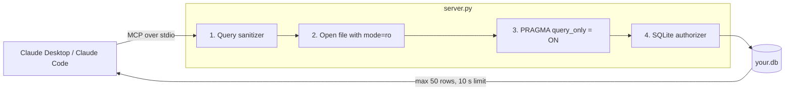

<div align="center">

# mcp-sqlite-insights

**Let Claude explore any SQLite database without ever being able to change it.**

[](https://github.com/RayaanKaz/mcp-sqlite-insights/actions/workflows/tests.yml)


[](LICENSE)

[Quick start](#quick-start) · [Connect to Claude](#connect-to-claude) · [Tools](#tools) · [Security model](#security-model) · [Configuration](#configuration)

</div>

---

A [Model Context Protocol](https://modelcontextprotocol.io) server that gives Claude Desktop, Claude Code and any other MCP client two tools: one that **maps a SQLite database's structure** and one that **runs read-only SQL**. Point it at a `.db` file and ask questions in plain English:

> *Which product category brought in the most revenue this year?*
> *Find customers who signed up but never placed an order.*
> *Is `orders.customer_id` indexed? Show me the query plan for looking up one customer's orders.*

- **Read-only by construction.** Four independent layers, including SQLite's own read-only mode and a native authorizer, so a write is refused even if the model tries one.
- **Context-friendly.** Results are Markdown tables capped at 50 rows, long values are truncated, and slow queries are cancelled after 10 seconds.
- **Zero config.** With no database configured it creates a realistic demo database, so you can try it immediately.
- **One dependency.** Just the official [MCP Python SDK](https://github.com/modelcontextprotocol/python-sdk); SQLite support ships with Python.

### Why read-only matters

Agents like Claude Code increasingly run tools on their own. A database tool that *can* write is one mistaken `DELETE` away from data loss, and an instruction in a prompt is not a security boundary. This server makes writes impossible at the SQLite level, so you can let Claude explore a database without reviewing every query first.

---

## Quick start

Requires Python 3.10 or newer.

**With [uv](https://docs.astral.sh/uv/)** (no virtual environment needed; dependencies are declared inside `server.py`):

```bash
git clone https://github.com/RayaanKaz/mcp-sqlite-insights.git
cd mcp-sqlite-insights
uv run server.py --check
```

**With pip:**

```bash
git clone https://github.com/RayaanKaz/mcp-sqlite-insights.git
cd mcp-sqlite-insights
python3 -m venv .venv
source .venv/bin/activate          # Windows: .venv\Scripts\activate
python -m pip install -r requirements.txt
python server.py --check
```

`--check` creates the demo database, runs both tools, and proves that a `DELETE` is blocked. It ends with `Self-check passed.`

---

## Connect to Claude

### Claude Desktop

Open **Settings → Developer → Edit Config** and add the server to `claude_desktop_config.json`. Use **absolute paths**: Claude Desktop does not use your shell's `PATH` or activate virtual environments.

**macOS / Linux (pip install):**

```json
{
  "mcpServers": {
    "sqlite-insights": {
      "command": "/absolute/path/to/mcp-sqlite-insights/.venv/bin/python",
      "args": ["/absolute/path/to/mcp-sqlite-insights/server.py"]
    }
  }
}
```

<details>
<summary><b>Windows (pip install)</b></summary>

```json
{
  "mcpServers": {
    "sqlite-insights": {
      "command": "C:\\Users\\you\\mcp-sqlite-insights\\.venv\\Scripts\\python.exe",
      "args": ["C:\\Users\\you\\mcp-sqlite-insights\\server.py"]
    }
  }
}
```

Backslashes must be doubled inside JSON strings.
</details>

<details>
<summary><b>Using uv instead</b></summary>

Find uv's full path with `which uv` (macOS/Linux) or `where uv` (Windows), then:

```json
{
  "mcpServers": {
    "sqlite-insights": {
      "command": "/absolute/path/to/uv",
      "args": ["run", "/absolute/path/to/mcp-sqlite-insights/server.py"]
    }
  }
}
```
</details>

**Use your own database** by adding an `env` block (or `"--db", "/path/to/file.db"` at the end of `args`):

```json
      "env": { "SQLITE_INSIGHTS_DB": "/absolute/path/to/your.db" }
```

Quit Claude Desktop completely and reopen it. The two tools appear under the tools menu in the chat box.

### Claude Code

```bash
claude mcp add --transport stdio sqlite-insights -- \
  /absolute/path/to/mcp-sqlite-insights/.venv/bin/python \
  /absolute/path/to/mcp-sqlite-insights/server.py --db /absolute/path/to/your.db
```

Leave out `--db ...` to use the demo database.

---

## Tools

| Tool | Arguments | Returns |
|---|---|---|
| `inspect_schema` | `table_name` *(optional)* | Overview of every table and view (row and column counts), then each table's columns, types, primary keys, NOT NULL, defaults, foreign keys and indexes. With `table_name`: that table only, plus 3 sample rows showing real data formats. |
| `execute_query` | `sql` | Result as a Markdown table: at most 50 rows, with a note when more rows matched, plus timing. |

Both tools declare MCP annotations `readOnlyHint: true`, `destructiveHint: false`, `idempotentHint: true` and `openWorldHint: false`. The server also sends instructions telling Claude to inspect the schema first and to prefer aggregates over raw rows.

Example `execute_query` result:

```
| month | orders | revenue |
|---|---|---|
| 2025-01 | 9 | 3114.43 |
| 2025-02 | 8 | 1538.38 |
| 2025-03 | 12 | 4353.85 |

_3 row(s) returned (0.6 ms)._
```

---

## Security model



| Layer | Mechanism | Stops |
|---|---|---|
| 1. Query sanitizer | Exactly one statement, starting with `SELECT`, `WITH`, `VALUES` or `EXPLAIN`, with no write or admin keywords. String literals and comments are masked first, so `WHERE note = 'DELETE'` is not a false positive. | `DROP TABLE`, `SELECT 1; DELETE ...`, `WITH x AS (...) DELETE ...` |
| 2. Read-only open | The file is opened through a `file:...?mode=ro` URI. | Any write to the file, and creating a file that does not exist |
| 3. `query_only` | `PRAGMA query_only = ON` on every connection. | Writes to the main database and to anything attached |
| 4. Authorizer | A native SQLite callback that allows only read operations while each statement is compiled. | Anything unexpected that gets past layer 1, including `load_extension` |

The test suite attacks each native layer with the others disabled, and checks the database file's hash before and after. It also runs 21 bypass attempts against the full server (stacked statements, comment and string tricks, CTE-wrapped writes, `ATTACH`, `VACUUM INTO`, pragma functions, `load_extension`, an endless recursive query) and checks that each is refused, the database file is unchanged and no new file appears next to it.

**Additional hardening:** `trusted_schema = OFF`; SQLite defensive mode (Python 3.12+); `ATTACH` disabled outright and single values capped at 50 MB (both Python 3.11+); a fresh connection for every call; a 10-second query timeout; memory-bounded fetching (at most 51 rows are ever read from a result); 300-character cell truncation; logs on stderr only.

**What it does not do:**

- **Read-only is not private.** Every row a query returns becomes part of your conversation with the model. Don't connect a database containing data you are not allowed to share with your AI provider.
- It can read every table in the file. There is no per-table or per-column allowlist yet ([contributions welcome](#contributing)).
- It is built for local, single-user use over stdio, with no network transport or authentication.
- **It protects only its own access path.** If Claude also has shell or file tools, as in Claude Code, those tools can reach the database file directly. See below.

### Using it alongside Claude Code

In Claude Desktop with no other file or shell tools connected, this server is Claude's only way to reach the database. Claude Code can also run shell commands and edit files, so protect the file itself:

1. **Keep the database outside your project folder**, for example in `~/data/`.
2. **Turn on Claude Code's sandbox** with `/sandbox`. Sandboxed commands can write only to the working directory, a temp directory and folders you add, and the operating system enforces this for every process they start.
3. Optionally, deny the folder explicitly in `.claude/settings.json`:

```json
{
  "sandbox": { "filesystem": { "denyWrite": ["~/data"] } },
  "permissions": { "deny": ["Edit(~/data/**)"] }
}
```

Permission rules on their own are not enough: an `Edit` deny rule does not cover a script that opens the file itself, and a rule like `Bash(sqlite3 *)` does not match `/usr/bin/sqlite3`. The sandbox is the OS-level boundary. See Claude Code's [sandboxing](https://code.claude.com/docs/en/sandboxing) and [permissions](https://code.claude.com/docs/en/permissions) docs.

---

## Configuration

| Setting | How | Default |
|---|---|---|
| Database file | `--db PATH` or the `SQLITE_INSIGHTS_DB` environment variable (`--db` wins) | `demo.db`, created next to `server.py` |
| Row cap | `MAX_ROWS` in `server.py` | 50 |
| Query timeout | `QUERY_TIMEOUT_SECONDS` | 10 seconds |
| Cell length | `MAX_CELL_CHARS` | 300 characters |

The **demo database** is a small shop: `customers` (40), `products` (15), `orders` (200), `order_items` (508) and a `monthly_revenue` view, with foreign keys, indexes and a few NULLs. It is generated from a fixed seed, so every machine gets identical data.

---

## Development

```bash
python -m unittest -v
```

32 tests cover sanitizer bypass attempts, a red-team suite against the full server, each read-only layer on its own, the timeout, the row cap, Markdown escaping, awkward file names and identifiers, and a full stdio round trip through an MCP client. CI runs them on Linux, Windows, and macOS (Apple Silicon and Intel) with Python 3.10 to 3.13.

## Contributing

Issues and pull requests are welcome. Some ideas:

- Per-table and per-column allowlists (for example, hiding an `email` column)
- Publishing to PyPI so the server can be launched with `uvx`
- Support for more than one database at a time

Please include a test with any change to the read-only layers.

## License

[MIT](LICENSE). Built on the official [MCP Python SDK](https://github.com/modelcontextprotocol/python-sdk). This is a community project and is not affiliated with or endorsed by Anthropic.
